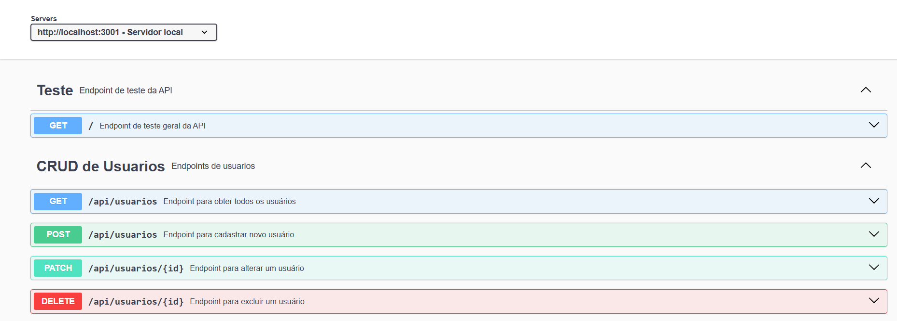

# Aula 01 - Recursos Avançados para Desenvolvimento de Software

## Criação de API e Documentação

Utilizaremos o **Swagger** para criar e documentar uma API RESTful.  
O Swagger é uma ferramenta poderosa que permite descrever a estrutura da API de forma clara e interativa.

---

## Capacidades Técnicas

1. Definir a sequência das atividades para desenvolvimento dos componentes, de acordo com os requisitos do sistema.  
2. Definir a infraestrutura física a ser utilizada no desenvolvimento dos componentes.  
3. Projetar os componentes do sistema considerando as plataformas computacionais.  
4. Definir os softwares a serem utilizados no desenvolvimento do sistema.  
5. Definir as dependências de software considerando os componentes do sistema, para a sua implantação.  
6. Elaborar documentação técnica do sistema.  
7. Implementar as funcionalidades de acordo com os requisitos definidos.  

---

## Capacidades Socioemocionais

1. Demonstrar autogestão.  
2. Demonstrar pensamento analítico.  

---

## Conhecimentos

### 1. Qualidade de Software  
- 1.1 Definição  
- 1.2 Ferramentas  
- 1.3 Processos de trabalho

### 2. Metodologia de Gerenciamento de Projeto  
- 2.1 Escopo  
- 2.2 Recursos

---

## Demonstração

Vamos criar um exemplo simples de uma API com controle de acessos e produtos. A API terá os seguintes endpoints:

### Autenticação

- `POST /api/login`: Endpoint para autenticação de usuários.

### Gerenciamento de Usuários

- `GET /api/usuarios`: Listar todos os acessos.  
- `POST /api/usuarios`: Criar um novo acesso.  
- `PUT /api/usuarios/:id`: Atualizar um acesso existente.  
- `DELETE /api/usuarios/:id`: Excluir um acesso.

### Gerenciamento de Produtos

- `GET /api/produtos`: Listar todos os produtos.  
- `POST /api/produtos`: Criar um novo produto.  
- `PUT /api/produtos/:id`: Atualizar um produto existente.  
- `DELETE /api/produtos/:id`: Excluir um produto.

### Gerenciamento de Pedidos

- `GET /api/pedidos`: Listar todos os pedidos.  
- `POST /api/pedidos`: Criar um novo pedido.  
- `PUT /api/pedidos/:id`: Atualizar um pedido existente.  
- `DELETE /api/pedidos/:id`: Excluir um pedido.

---

## UML - Diagrama de Classes

Será utilizado um modelo de **Diagrama de Classes (DC)** para representar a estrutura da API.  
O diagrama incluirá as classes: `Usuario`, `Produto` e `Pedido`, com seus respectivos atributos e métodos.

---

## Projeto: Node.js + Prisma + MySQL + Swagger

### Passo a Passo

#### 1. Inicialização

```bash
mkdir pedidos-api
cd pedidos-api
code .
npm init -y
```

#### 2. Instalação de Dependências

```bash
npm install express cors dotenv
npm install prisma -g
npx prisma init --datasource-provider mysql
```

#### 3. Configuração do `.env`

```env
DATABASE_URL="mysql://root@localhost:3306/pedidos-api?schema=public&timezone=UTC"
```

#### 4. Schema do Prisma (`prisma/schema.prisma`)

```prisma
generator client {
  provider = "prisma-client-js"
}

datasource db {
  provider = "mysql"
  url      = env("DATABASE_URL")
}

model Usuario {
  id        Int      @id @default(autoincrement())
  email     String   @unique
  nome      String
  senha     String
  tipo      Tipo
  pedidos   Pedido[]
}

enum Tipo {
  ADMIN
  CLIENTE
}

model Produto {
  id        Int      @id @default(autoincrement())
  nome      String
  descricao String
  imagem    String
  preco     Float
  pedidos   Pedido[]
}

model Pedido {
  id         Int       @id @default(autoincrement())
  usuarioId  Int
  produtoId  Int
  quantidade Int
  data       DateTime  @default(now())
  usuario    Usuario   @relation(fields: [usuarioId], references: [id])
  produto    Produto   @relation(fields: [produtoId], references: [id])
}
```

#### 5. Arquivo `server.js` (inicial)

```js
const express = require('express');
const cors = require('cors');
const routes = require('./src/router');

const app = express();
app.use(express.json());
app.use(cors());
app.use(routes);

app.listen(3001, () => {
    console.log('API respondendo em http://localhost:3001');
});
```

#### 6. Arquivo `src/router.js`

```js
const express = require('express');
const routes = express.Router();

routes.get('/', (req, res) => {
    res.send('API Pedidos respondendo');
});

module.exports = routes;
```

#### 7. Criar Tabelas no Banco

```bash
npx prisma migrate dev --name init
```

#### 8. Executar a API

```bash
npx nodemon
```

---

## Controladores

Crie os seguintes arquivos na pasta `src/controllers`:

### `usuario.js`

```js
// CRUD de usuários...
// read, create, update, del
```

### `produto.js`

```js
// CRUD de produtos...
// read, create, update, del
```

### `pedido.js`

```js
// CRUD de pedidos...
// read, create, update, del
```

---

## Rotas Completas (`src/router.js`)

```js
const express = require('express');
const routes = express.Router();

const Usuario = require('./controllers/usuario');
const Produto = require('./controllers/produto');
const Pedido = require('./controllers/pedido');

routes.get('/', (req, res) => {
    res.json({ titulo: 'API Pedidos respondendo' });
});

// Usuários
routes.get('/api/usuarios', Usuario.read);
routes.post('/api/usuarios', Usuario.create);
routes.patch('/api/usuarios/:id', Usuario.update);
routes.delete('/api/usuarios/:id', Usuario.del);

// Produtos
routes.get('/api/produtos', Produto.read);
routes.post('/api/produtos', Produto.create);
routes.patch('/api/produtos/:id', Produto.update);
routes.delete('/api/produtos/:id', Produto.del);

// Pedidos
routes.get('/api/pedidos', Pedido.read);
routes.post('/api/pedidos', Pedido.create);
routes.patch('/api/pedidos/:id', Pedido.update);
routes.delete('/api/pedidos/:id', Pedido.del);

module.exports = routes;
```

---

## Testes com Insomnia ou Postman

> Realize testes com as rotas acima utilizando o **Insomnia** ou o **Postman**.  
> Adicione imagens dos testes para documentação.

---

## Documentação com Swagger

### 9. Instalar o Swagger

```bash
npm install swagger-jsdoc
npm install swagger-ui-express
```

### 10. Alterar o `server.js` para incluir o Swagger

```js
const express = require('express');
const cors = require('cors');
const swaggerUi = require('swagger-ui-express');

const swaggerDoc = require('./swagger.json');
const routes = require('./src/router');

const app = express();
app.use(express.json());
app.use(cors());

app.use('/docs', swaggerUi.serve, swaggerUi.setup(swaggerDoc));

app.use(routes);

app.listen(3001, () => {
    console.log('API respondendo em http://localhost:3001');
    console.log('Documentação em http://localhost:3001/docs');
});
```

### 11. Criar o arquivo `swagger.json`

```json
{
  "openapi": "3.0.0",
  "info": {
    "title": "API de Produtos (Node + Prisma + MySQL[MariaDB])",
    "version": "1.0.0",
    "description": "Documentação da API Pedidos"
  },
  "servers": [
    {
      "url": "http://localhost:3001",
      "description": "Servidor local"
    }
  ],
  "tags": [
    {
      "name": "Teste",
      "description": "Endpoint de teste da API"
    },
    {
      "name": "CRUD de Usuarios",
      "description": "Endpoints de usuarios"
    }
  ],
  "paths": {
    "/": {
      "get": {
        "tags": [
          "Teste"
        ],
        "summary": "Endpoint de teste",
        "responses": {
          "200": {
            "description": "Retorna uma mensagem de teste"
          }
        }
      }
    }
  }
}
```

---

### 12. Executar novamente a API

```bash
npx nodemon
```

Acesse:
- API: [http://localhost:3001](http://localhost:3001)
- Documentação Swagger: [http://localhost:3001/docs](http://localhost:3001/docs)

---

## Prints e Demonstrações

Inclua aqui:
- Captura de tela do Insomnia/Postman testando as rotas.
- Captura de tela da interface Swagger funcionando.


---

## Conclusão

Com esse projeto, conseguimos:
- Criar uma API RESTful com autenticação e gerenciamento de dados.
- Utilizar o Prisma como ORM para manipulação do banco de dados MySQL.
- Documentar a API com Swagger para facilitar testes e entendimento da estrutura.

> Esse README serve como guia completo para criação, estruturação e execução de uma API moderna com boas práticas.


# Aula 02 - Recursos Avançados para Desenvolvimento de Software
---

## Autenticação JWT em APIs

Nesta seção, vamos implementar autenticação JWT (JSON Web Token) para proteger endpoints da API.

### 1. Instalação de Dependências

```bash
npm install jsonwebtoken
```

Adicione ao arquivo `.env`:

```env
SECRET_JWT="meu_segredo_jwt"
```

---

### 2. Endpoint de Login e Validação

Crie `src/controllers/login.js`:

```js
const jsonwebtoken = require("jsonwebtoken");
const { PrismaClient } = require('@prisma/client');
const prisma = new PrismaClient();

const login = async (req, res) => {
    const { email, senha, validade } = req.body;
    try {
        const usuario = await prisma.usuario.findFirst({
            where: { email, senha }
        });
        if (!usuario) {
            return res.status(401).json({ message: 'E-mail ou Senha incorretos!' });
        } else {
            const token = jsonwebtoken.sign(
                { id: usuario.id, nome: usuario.nome, email: usuario.email },
                process.env.SECRET_JWT,
                { expiresIn: validade ? validade + "min" : "60min" }
            );
            res.status(200).json({ token });
        }
    } catch (err) {
        res.status(500).json({ message: 'Erro interno do servidor' });
    }
};

const validaToken = (req, res) => {
    const token = req.headers.authorization?.split(" ")[1];
    if (!token) {
        return res.status(401).send({ message: "Acesso negado. Nenhum token recebido." });
    }
    jsonwebtoken.verify(token, process.env.SECRET_JWT, (err, decoded) => {
        if (err) {
            return res.status(403).send({ message: "Token inválido ou expirado." });
        }
        res.status(200).json({ message: decoded });
    });
};

module.exports = { login, validaToken };
```

---

### 3. Middleware de Proteção

Crie `src/middlewares/auth.js`:

```js
const jsonwebtoken = require("jsonwebtoken");

const validate = (req, res, next) => {
    const token = req.headers.authorization?.split(" ")[1];
    if (!token) return res.status(401).send({ message: "Acesso negado. Nenhum token recebido." });
    try {
        const payload = jsonwebtoken.verify(token, process.env.SECRET_JWT);
        req.headers['user'] = payload;
        next();
    } catch (err) {
        res.status(403).send({ message: "Token inválido ou expirado." });
    }
};

module.exports = validate;
```

---

### 4. Rotas Protegidas

Atualize `src/router.js`:

```js
const express = require('express');
const routes = express.Router();

const Login = require('./controllers/login');
const Usuario = require('./controllers/usuario');
const Produto = require('./controllers/produto');
const Pedido = require('./controllers/pedido');
const MiddlewareAuth = require('./middlewares/auth');

routes.get('/', (req, res) => {
    res.json({ titulo: 'API Pedidos respondendo, documentação em /docs' });
});

routes.post('/api/login', Login.login);
routes.get('/api/validacao', Login.validaToken);

routes.get('/api/usuarios', MiddlewareAuth, Usuario.read);
routes.post('/api/usuarios', Usuario.create);
routes.patch('/api/usuarios/:id', MiddlewareAuth, Usuario.update);
routes.delete('/api/usuarios/:id', MiddlewareAuth, Usuario.del);

routes.get('/api/produtos', Produto.read);
routes.post('/api/produtos', MiddlewareAuth, Produto.create);
routes.patch('/api/produtos/:id', MiddlewareAuth, Produto.update);
routes.delete('/api/produtos/:id', MiddlewareAuth, Produto.del);

routes.get('/api/pedidos', MiddlewareAuth, Pedido.read);
routes.post('/api/pedidos', MiddlewareAuth, Pedido.create);
routes.patch('/api/pedidos/:id', MiddlewareAuth, Pedido.update);
routes.delete('/api/pedidos/:id', MiddlewareAuth, Pedido.del);

module.exports = routes;
```

---

### 5. Atualização da Documentação Swagger

No arquivo `swagger.json`, adicione os endpoints de login e validação:

```json
{
  "paths": {
    "/api/login": {
      "post": {
        "tags": ["Autenticação"],
        "summary": "Realiza login e retorna um token JWT",
        "requestBody": {
          "required": true,
          "content": {
            "application/json": {
              "schema": {
                "type": "object",
                "properties": {
                  "email": { "type": "string" },
                  "senha": { "type": "string" },
                  "validade": { "type": "string", "description": "Tempo de expiração em minutos (opcional)" }
                },
                "required": ["email", "senha"]
              }
            }
          }
        },
        "responses": {
          "200": { "description": "Token JWT gerado" },
          "401": { "description": "Credenciais inválidas" }
        }
      }
    },
    "/api/validacao": {
      "get": {
        "tags": ["Autenticação"],
        "summary": "Valida o token JWT enviado no header Authorization",
        "parameters": [
          {
            "name": "Authorization",
            "in": "header",
            "required": true,
            "schema": { "type": "string" },
            "description": "Bearer {token}"
          }
        ],
        "responses": {
          "200": { "description": "Token válido" },
          "401":